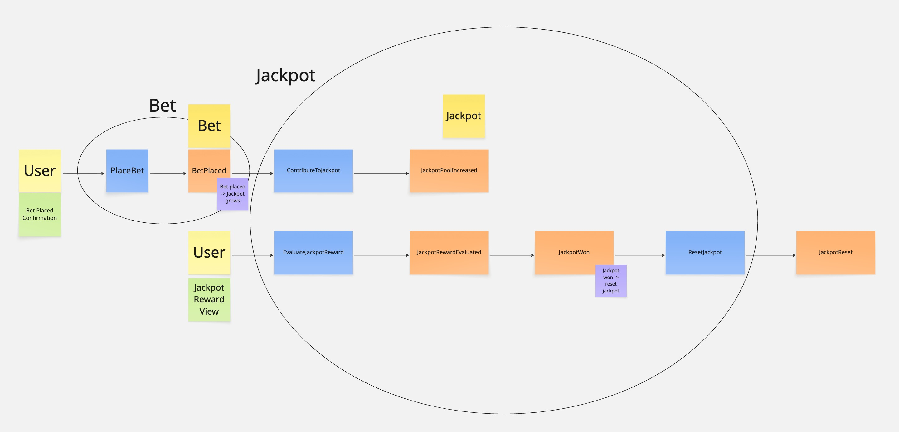

# Jackpot Service

A backend service that manages jackpot contributions and rewards. The service receives bets, contributes them to matching jackpot pools, and evaluates bets for jackpot rewards.

## Event Storming

Before implementation, an event storming session was conducted to identify the core domain concepts.

### Domain Events
- `BetPlaced` — a bet was placed by a user on a jackpot
- `JackpotPoolIncreased` — the jackpot pool grew as a result of a contribution
- `JackpotRewardEvaluated` — a bet was checked whether it wins the jackpot
- `JackpotWon` — a bet won the jackpot reward
- `JackpotReset` — the jackpot pool returned to its initial value after being won
### Commands
| Command | Issued By | Triggers |
|---|---|---|
| `PlaceBet` | User | `BetPlaced` |
| `ContributeToJackpot` | System | `JackpotPoolIncreased` |
| `EvaluateJackpotReward` | User | `JackpotRewardEvaluated` → `JackpotWon` (conditionally) |
| `ResetJackpot` | System | `JackpotReset` |

### Aggregates
| Aggregate | Responsibilities |
|---|---|
| `Bet` | Represents a valid placed bet, generates bet ID |
| `Jackpot` | Owns pool amount, contribution strategy, reward strategy, enforces all business rules |

### Policies
| When | Then |
|---|---|
| `BetPlaced` | → `ContributeToJackpot` |
| `JackpotWon` | → `ResetJackpot` |

### Read Models
| Read Model | Consumed By |
|---|---|
| `BetPlacedConfirmation` | User via `POST /api/v1/bets` response |
| `JackpotRewardView` | User via `POST /api/v1/jackpots/{jackpotId}/bets/{betId}/evaluate` response |
